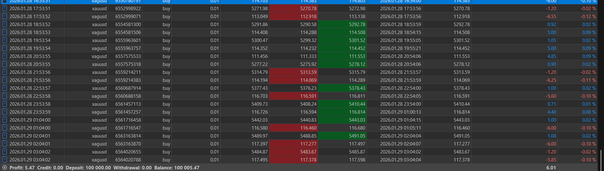

# Machine Learning Trading Bot (Experimental)

## Overview

This project is an experimental machine learning system applied to financial markets, focused on identifying patterns in price behavior without relying on traditional technical indicators.

The core idea was to explore whether a neural network could learn market structures autonomously, using raw price data instead of predefined indicators such as RSI or MACD.

---

## Visualization

---
## Core Hypothesis

> Financial markets contain structural patterns (such as imbalances and directional pressure) that can be learned directly by a neural network without relying on traditional chartist indicators.

The model attempts to infer its own representation of:

* Price imbalance
* Momentum shifts
* Candle structure behavior
* Micro-patterns in price movement

---

## What is an "Imbalance" (Conceptual Definition)

An imbalance is defined as:

> A situation where price moves aggressively in one direction with minimal opposition, creating inefficient price zones where trading activity is uneven.

These zones often represent:

* Strong directional pressure
* Liquidity gaps
* Areas where price may react or continue

The model is not explicitly programmed to detect these, but appears to learn patterns that resemble them.

---

## Architecture

The model intentionally uses a simple architecture to validate signal existence:

* **Input Layer:** 6 features (price-based)

* **Hidden Layer 1:** 32 neurons (ReLU)

* **Hidden Layer 2:** 16 neurons (ReLU)

* **Output Layer:** 1 neuron (Sigmoid)

* **Optimizer:** Adam

* **Loss Function:** Binary Crossentropy

The goal was not complexity, but to verify whether meaningful signals could emerge from structured price data.

---

## Feature Engineering

The model uses normalized price-based features:

* Return
* Range (High - Low)
* Body (Close - Open)
* Wick structure
* Net movement
* Momentum (rolling mean)

Example formulations:

* **Return:**
  (Close - Previous Close) / Previous Close

* **Relative Body Size:**
  |Close - Open| / (High - Low)

* **Momentum:**
  Rolling mean of price differences over n periods

This approach avoids dependency on traditional indicators and focuses on raw market structure.

---

## Target Definition

The model predicts whether price will:

* Hit Take Profit (TP) → 1
* Hit Stop Loss (SL) → 0

This simplifies the problem into a binary classification based on future price movement within a fixed window.

---

## Backtesting Logic

Trades are simulated under realistic conditions:

* Entry at next candle
* TP/SL evaluated using high/low
* Fixed risk per trade
* Sequential execution

This avoids purely theoretical evaluation.

---

## Live Trading Integration

The system integrates directly with MetaTrader 5 using the official Python API.

### Integration Approach

* Python handles:

  * Model inference
  * Feature extraction
  * Trade decision logic

* MetaTrader 5 handles:

  * Market data
  * Order execution
  * Position management

### Execution Flow

1. Fetch latest candles from MT5
2. Compute features
3. Run model prediction
4. Generate BUY/SELL signal
5. Send order via MT5 API
6. Apply TP/SL dynamically

This demonstrates the ability to connect machine learning systems with real trading infrastructure.

---

## Live Trading Results

The system was tested in a live/demo environment.

Observed behavior:

* Multiple trades executed across XAUUSD and XAGUSD
* Consistent TP/SL execution
* Small but positive net performance
* Controlled losses with occasional strong winning trades

Observations:

* Scalping behavior (small frequent gains)
* Some trades reached significantly higher profits (~95 in earlier sessions)
* Some trades remained open without hitting TP immediately

---

## Performance Insights

* Best performance: **XAUUSD (Gold)**
* Moderate performance: **XAGUSD (Silver)**
* Forex pairs: inconsistent or slightly negative

Interpretation:

> Gold provided clearer structural patterns for the model, while Forex markets appeared noisier under this approach.

---

## Market Conditions & Concept Drift

Testing was paused due to changes in market behavior.

> This is an example of **Concept Drift**, where the statistical properties of the market change over time.

In this case:

* Gold became significantly more volatile
* Previously learned patterns became less reliable

Due to this shift, testing was paused until more stable conditions return.

---

## Limitations

This is an experimental system and has known limitations:

* No walk-forward validation
* Initial dataset splitting may introduce data leakage
* Simplified TP/SL target
* Basic risk management (fixed risk)
* No advanced metrics (Sharpe ratio, drawdown)
* Model architecture intentionally simple

---

## Tech Stack

* **Language:** Python
* **ML:** TensorFlow / Keras
* **Data:** Pandas, NumPy
* **Integration:** MetaTrader 5 Python API

---

## Learning Outcomes

This project demonstrates:

* End-to-end ML pipeline design
* Feature engineering for financial data
* Real-world system integration
* Handling uncertainty in noisy environments
* Iterative experimentation and validation

---

## Project Context

This project was built as an exploration of applying machine learning to financial markets.

I do not claim expertise in quantitative finance.

However, it demonstrates my ability to:

* Learn complex topics independently
* Build complete systems from scratch
* Apply AI to real-world problems
* Iterate based on results

---

## Future Direction

Potential improvements:

* Walk-forward validation
* Time-based dataset splitting
* Improved risk management
* More robust models
* Hybrid approach (ML + chart-based structures)
* Re-testing after market stabilization

---

## Conclusion

This project represents a practical exploration of machine learning applied to financial markets.

It reflects my approach to development:

* Build
* Test
* Learn
* Iterate

While not production-ready, it demonstrates system-level thinking, adaptability, and the ability to execute complex technical ideas end-to-end.
